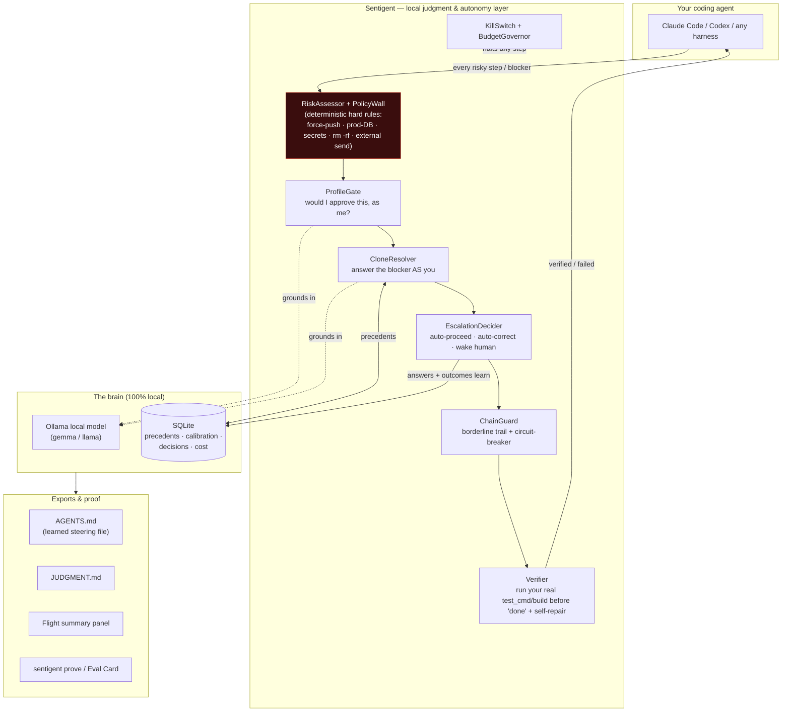

# Sentigent

**Intelligence is a commodity. Your learning loop isn't.**

Sentigent is a **durable loop engine** (a "dark factory") that drives a plan forward
across every Claude Code session boundary — and learns, from your own decision history,
when to push through a blocker versus stop and ask. The model is rentable. The loop you
own — your encoded workflows, your judgment, your guardrails — is the moat.

> **The industry direction (the Nadella / Microsoft framing, 2026):** the AI era won't
> be won by whoever has the best *model* — intelligence is becoming a commodity. It's
> won by whoever compounds **human capital + token capital** the fastest, via the
> strongest **learning loop between humans and AI.** Sentigent is that loop, as software
> you install, local-first.

The puzzle, mapped:

| Industry concept | Sentigent |
|---|---|
| **Token Capital** — intelligence encoded into systems (workflows, evals, playbooks, memory) | durable loop state + opt-in org guardrail packs + a local brain that remembers every decision |
| **The Learning Loop** — human seeds → AI captures → applies at scale → learns from outcomes → compounds | `loop_driver` runs fresh-context laps, verifies each against your own done-criteria, records what worked as **FAP** |
| **The moat test** — "switch models tomorrow, what do you lose? Nothing = no moat" | the answer becomes *"years of encoded judgment, guardrails, and faithful progress"* — model-independent capital |

---

## The one honest number — FAP (Faithful Autonomous Progress)

Sentigent reports exactly one headline metric, and it's impossible to fabricate — it
falls straight out of the loop's own persisted state: **how far and how faithfully it
drives a plan before it needs you.**

```text
SENTIGENT LOOP RECEIPT — Faithful Autonomous Progress across runs
────────────────────────────────────────────────────────────
  loop             FAP  dist   fid  auto  asks  goal
  loop_83cc8641   100%  100%  100%  100%     0  Write a pytest suite for loop_driver
────────────────────────────────────────────────────────────
  1 loop · 1 completed · mean FAP 100% · paged you 0×
  FAP over time  █  insufficient data — need ≥4 runs to show a trend (have 1)
```

- **Distance** = steps done ÷ total · **Fidelity** = verified ÷ done · **Autonomy** = self-resolved ÷ blockers faced
- **FAP** = verified-with-zero-help ÷ total · **Faithful streak** = longest hands-off verified run
- **FAP over time** = is the loop getting smarter? (compounding ↑ / flat / regressing — honest about insufficient data)

**Honest status.** Proven: real cross-session resume, per-step verify gates, and real
`claude -p` runs completing real code — the loop wrote its own test suite (`tests/test_loop_driver.py`,
FAP 100%, 0 asks, independently re-verified). The frontier we're building: proving FAP
*compounds* across many runs as the learned push-vs-ask judgment improves. We report only
numbers the loop actually produced — no fabricated "judgment score."

---

## Quickstart

```bash
uv pip install sentigent

# seed a plan (durable across sessions; each step can carry its own done-criteria)
python -m sentigent.operator.loop_driver start --goal "Ship feature X with passing tests"

# drive it — fresh-context laps, closed-loop verify each step (dry-run unless --execute)
python -m sentigent.operator.loop_driver drive <loop_id> --execute

# the scoreboard
python -m sentigent.operator.loop_driver receipt
```

Also exposed over MCP (`loop_start` / `loop_drive` / `loop_resume` / `loop_status` /
`loop_receipt`) so the loop is callable from inside Claude Code. Local-first: your plans,
decisions, and brain stay on your machine.

---

## For teams — guardrails you can enforce

Loops shouldn't drive off a cliff. Sentigent ships **org guardrail packs** — data-driven
YAML rules (`block` / `approve` / `warn`) evaluated on every lap. Encode your org's safety
invariants once; every autonomous loop respects them. Opt-in, versioned, reviewable in git.

---

## The wedge vs. raw loops

| | What you get |
|---|---|
| **Raw Ralph loop** | autonomy, but no judgment — it just re-runs; model-coupled |
| **A bare harness** | structure, but static rules — you babysit the hard moments |
| **Sentigent** | durable cross-session loop + push-vs-ask learned from *your* history + org guardrails per lap + an honest FAP receipt |

---

## What It Does

Sentigent is an embedded judgment layer that runs alongside your agent. Before every
significant action, it evaluates whether to **proceed**, **slow down** (add validation),
**enrich** (gather context), or **escalate** (route to human).

It doesn't use rules you write. It learns from outcomes.

### The Five Signals

Sentigent computes five signals from the gap between what your agent has learned to
expect and what it's currently seeing:

| Signal | What It Does |
|--------|-------------|
| **Caution** | Triggers on anomalies vs. learned baselines |
| **Doubt** | Seeks context when pattern match is weak |
| **Urgency** | Reduces deliberation for time-sensitive actions |
| **Confidence** | Enables fast-path for routine operations |
| **Frustration** | Triggers strategy change after repeated failures |

These aren't static. They shift as the agent operates. A $50K refund that triggers
caution on day 1 might be routine on day 180 — because the agent learned that
enterprise accounts process them regularly.

---

## Architecture at a glance

Sentigent sits **between your coding agent and the work** — a local-first judgment + verification
layer. Nothing leaves your machine: the model-of-you runs on Ollama, the brain is local SQLite.



**Where it fits in the ecosystem** (the "kits" around it):

| Layer | Sentigent uses / aligns with |
|---|---|
| Agent harness | **Claude Code** (`claude -p` headless worker), Codex, or any MCP client |
| Local inference | **Ollama** (Gemma 3 for the resolver, llama 3 for the gate) |
| Steering standard | emits **`AGENTS.md`** — the same steering-file format AWS Kiro / "frontier teams" hand-write, except *learned and self-updating* |
| Verification | runs the project's own **pytest / npm test / cargo / go** as the Definition-of-Done (shift-left) |
| Isolation | git **worktrees** for execute mode; nothing touches your main tree until verified |
| Evaluation | **SWE-bench-style A/B** harness (Sentigent ON vs blank agent) — see `docs/EVALUATION.md` |
| Protocol | **MCP** (Model Context Protocol) for the judgment tools + PreToolUse/PostToolUse hooks |

---

## Latest: the autonomous loop ("fly mode") — hardened & proven

Recent work (decision log `docs/DECISIONS.md`, D-014 → D-021) made the unattended loop trustworthy,
not just present. Every item below is in the codebase with regression tests:

- **Self-healing learning loop** — answered blockers reconcile into precedents at every run start, so a
  stale server can't silently stop the loop from compounding. `scripts/doctor.py --fix` repairs on demand.
- **Execute-mode verifier, proven live** — `operate(execute=True)` runs your *real* `test_cmd` and
  refuses to mark a step done unless it passes; a fail drives bounded **self-repair** retries, then
  pauses. End-to-end regression test, real git worktree + real subprocess.
- **Anti-hallucination gate hardened** — empty/vacuous done-criteria now **fail closed** (no false greens).
- **PolicyWall is sticky** — if *any* hard rule matches, the step escalates regardless of score. The
  inviolable safety floor now has its own test suite.
- **Chain circuit-breaker + borderline trail** — borderline auto-applies (the clone *just* cleared its
  confidence floor) are recorded to a reviewable trail, and after N in a row the loop **pauses for a
  human** instead of letting barely-confident calls compound into drift.
- **Flight summary** — a clean end-of-run panel: this flight + all-time vital signs + a decision-DNA bar,
  read live from the brain. Real numbers only.

---

## Quick Start (Claude Code / Any AI Coding Agent)

```bash
pip install sentigent
sentigent init
```

This:
1. Connects to your Claude Code config
2. Installs hook files that intercept every Bash/Write/Edit call
3. Starts the MCP server with 18 judgment tools

From that moment, every destructive command, deploy, or sensitive file write
is evaluated against learned experience.

### MCP Tools Available

```bash
# The core loop
sentigent_evaluate(tool_name="Bash", tool_input="rm -rf dist/", context={"reason": "clean build"})
# → {"action": "proceed", "reason": "Routine clean — seen 47x, correct 100%"}

sentigent_outcome(trace_id="...", outcome="correct")
# → Records the outcome, updates Brier score, reinforces learned pattern

# See what it's learned
sentigent_score()
# → {"judgment_score": 0.94, "total_rated": 847, "correct": 796, "brier": 0.087}

sentigent_patterns()
# → Lists 23 learned procedural rules with success rates

# Org governance
sentigent_policy(action="list")
# → 5 active policies: no_force_push (critical), review_before_deploy (high), ...

sentigent_profile(action="get")
# → Active profile: security_engineer (value_weights: security=1.0, compliance=0.95)

# Proof of value
sentigent_prove(days=90)
# → Full proof report with top catches, Brier score, accuracy trajectory

# Collective intelligence (Layer 3)
sentigent_collective(action="status")
# → Pool: 0 patterns (opt-in to contribute your anonymized patterns)
```

---

## The Three-Layer Learning Stack

```
Layer 3: COLLECTIVE INTELLIGENCE
  Anonymized patterns from orgs that opted in.
  "Across all deployments, force pushes after 5pm on Fridays
   are 4x more likely to be accidental."

Layer 2: ORGANIZATIONAL WISDOM
  All agents in your org share a single learning surface.
  "Your security team has set a policy: all deploys require
   human escalation. Your PM profile weights delivery_speed=0.8."

Layer 1: AGENT INTUITION
  This specific agent's 847 decisions and what it learned.
  "This agent has learned that 'cleanup' tasks touching node_modules
   are safe to proceed; 'cleanup' tasks near .env files need slow_down."
```

All three layers are live and running. Layer 1 stores to local SQLite (<50ms
latency, zero network dependency). Layer 2 syncs to Supabase for org-wide
sharing. Layer 3 accepts opt-in anonymized contributions.

---

## Org Governance (Layer 2)

For teams deploying multiple agents, Sentigent provides org-level controls:

### Policies — Rules That Override All Agents

```bash
sentigent policy list

Active org policies (hussi):
  no_force_push        [critical] Bash: push --force|push -f         → block
  review_before_deploy [high]     Bash: deploy|publish|kubectl apply  → escalate
  protect_env_files    [high]     Write: \.env$|credentials|\.pem$    → slow_down
  protect_production_db[critical] Bash: DROP TABLE|TRUNCATE TABLE     → block
  no_rm_rf             [critical] Bash: rm -rf|rm -fr                 → escalate
```

Policies are set by org admins and automatically enforced across every agent in
the org. No agent can override a `block` or `escalate` policy.

### Profiles — Shape Each Agent's Values

```bash
sentigent profile assign --name security_engineer
# This agent now:
# - Weights security=1.0, compliance=0.95 in signal computation
# - Has a lower caution_threshold (more sensitive)
# - Gets context injected: "flag secrets, auth issues, injection risks"
```

Available built-in profiles: `product_manager`, `security_engineer`,
`data_analyst`, `devops_engineer`.

### Row-Level Security

Every Supabase table is isolated by org_id. An agent from org A cannot
read patterns, policies, or episodes from org B — enforced at the database
level via PostgreSQL RLS, not application code.

---

## Dashboard

```bash
sentigent web
# → http://localhost:7373
```

Live tabs:
- **Overview** — decisions, outcomes, signal distributions
- **Patterns** — 23 learned rules with confidence and sample sizes
- **Policies** — org-wide enforcement rules and violation log
- **Proof of Value** — Brier score trajectory and top catches
- **Profile** — active role, value weights, AI context hint
- **Prompt Health** — which task descriptions correlate with failure
- **Insights** — computed signal trends and calibration quality

---

## Installation

```bash
pip install sentigent
```

### Claude Code Integration

```bash
sentigent init
```

Adds to your `~/.claude/settings.json`:
```json
{
  "hooks": {
    "PreToolUse": [{"matcher": "Bash|Write|Edit", "hooks": [{"type": "command", "command": "..."}]}],
    "PostToolUse": [{"matcher": "Bash|Write|Edit", "hooks": [{"type": "command", "command": "..."}]}]
  },
  "mcpServers": {
    "sentigent": {"command": "sentigent-mcp"}
  }
}
```

### Any Python Framework

```python
from sentigent import Sentigent

judge = Sentigent(agent_id="my_agent", org_id="my_org")

# Before each action
decision = judge.evaluate(
    task="Deploy to production",
    context={"branch": "main", "tests_passing": True},
    tool_name="Bash",
    tool_input="kubectl apply -f k8s/prod/",
)
# → {"action": "escalate", "reason": "Deploy policy: requires human sign-off"}

# After outcome known
judge.record_outcome(decision.trace_id, outcome="correct")
```

---

## Architecture

```
YOUR ENVIRONMENT                              SUPABASE (your account)
┌─────────────────────────────────┐          ┌────────────────────────────┐
│  Agent → Hooks → MCP Server     │          │  org_policies              │
│  ┌─────────────────────────┐    │  async   │  org_profiles              │
│  │  Layer 1: SQLite        │────┼─────────▶│  synced_episodes           │
│  │  • episodes (<50ms)     │    │          │  org_patterns              │
│  │  • procedural_rules     │◀───┼──────────│  org_baselines             │
│  │  • baselines            │    │  pull    │  policy_violations         │
│  └─────────────────────────┘    │          │  layer3_shared_patterns    │
│                                 │          └────────────────────────────┘
│  sentigent prove                │
│  sentigent policy list          │          All tables: RLS by org_id
│  sentigent collective status    │          No cross-org data leakage
└─────────────────────────────────┘
```

- **Hot path (<50ms):** Signal computation, decision gate, policy check — all local.
- **Warm path (on outcome record):** Episodes synced to Supabase for org aggregation.
- **Cold path (opt-in):** Anonymized patterns contributed to Layer 3 pool.

---

## Roadmap

- [x] Core engine (5 signals, decision gate, Brier calibration)
- [x] Layer 1: Per-agent episodic + procedural learning (SQLite)
- [x] Claude Code integration (MCP + hooks, 18 tools)
- [x] Layer 2: Org-wide policies + profiles (Supabase)
- [x] Layer 2: Row-level security (multi-tenant isolation)
- [x] Proof of value report (prove command, top catches, Brier score)
- [x] Prompt health analysis (correlate task descriptions with outcomes)
- [x] Layer 3: Cross-org collective intelligence (opt-in, anonymized)
- [x] Web dashboard (overview, patterns, policies, proof, profile, prompt health)
- [x] M1: Intent synthesis from memory (`sentigent_intent` tool)
- [x] M2: Skill routing at session start (PreToolUse hook)
- [x] M3: Autonomous setup agent (`sentigent_setup_agent`, Apply+Undo)
- [x] M4: Org-wide setup sharing (`org_setup_patterns` Supabase table)
- [ ] LangGraph deep integration
- [ ] OpenAI Agents SDK integration
- [ ] Fine-tuned signal model (neural heuristics from episodic data)
- [ ] Automated policy suggestions from violation patterns
- [ ] Benchmark: judgment score vs. baseline on shared eval set

---

## Philosophy

The next breakthrough in AI governance isn't more rules — it's judgment
built from experience, measured by accuracy, and proven with data.

Every senior engineer was once a junior one. The difference is 10,000 decisions
that trained their intuition. Sentigent gives every AI agent that same path —
from industry baselines to earned operational wisdom.

For the research exploration behind these ideas — how AI systems might develop
genuine internal states — see [LEM (Large Emotional Model)](https://github.com/hussi9/lem).

---

## License

MIT
