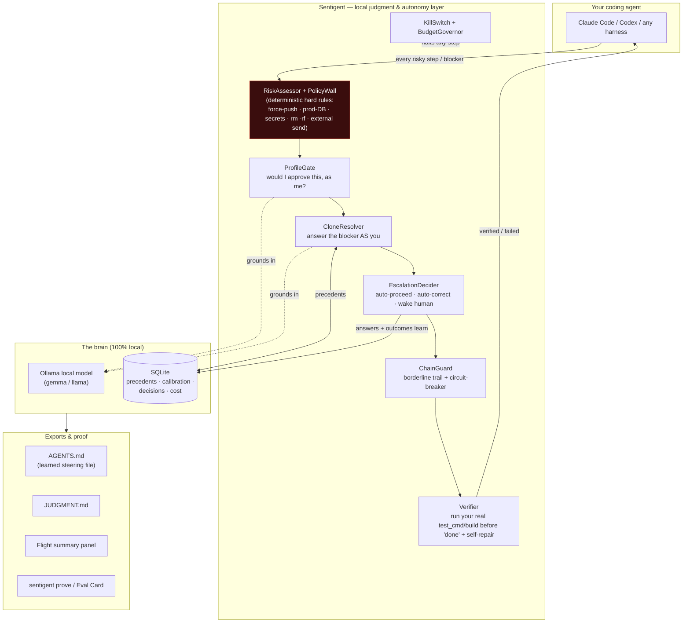

# Sentigent

**Intelligence is a commodity. Your learning loop isn't.**

Sentigent is a **durable loop engine** (a "dark factory") that drives a plan forward
across every Claude Code session boundary — and learns, from your own decision history,
when to push through a blocker versus stop and ask. The model is rentable. The loop you
own — your encoded workflows, your judgment, your guardrails — is the moat.

> **The industry direction (the Nadella / Microsoft framing, 2026):** the AI era won't
> be won by whoever has the best *model* — intelligence is becoming a commodity. It's
> won by whoever compounds **human capital + token capital** the fastest, via the
> strongest **learning loop between humans and AI.** Sentigent is that loop, as software
> you install, local-first.

The puzzle, mapped:

| Industry concept | Sentigent |
|---|---|
| **Token Capital** — intelligence encoded into systems (workflows, evals, playbooks, memory) | durable loop state + opt-in org guardrail packs + a local brain that remembers every decision |
| **The Learning Loop** — human seeds → AI captures → applies at scale → learns from outcomes → compounds | `loop_driver` runs fresh-context laps, verifies each against your own done-criteria, records what worked as **FAP** |
| **The moat test** — "switch models tomorrow, what do you lose? Nothing = no moat" | the answer becomes *"years of encoded judgment, guardrails, and faithful progress"* — model-independent capital |

---

## See it work


Recorded for real against a prepared demo repo — nothing here is scripted output. `sentigent init`
runs live; the `git commit` that gets blocked is genuinely blocked by the same PreToolUse hook Claude
Code calls on every tool call; the failing test genuinely fails; the fix is a real one-line patch; the
second commit is genuinely allowed once the practice is satisfied. See
[`docs/demo-README.md`](docs/demo-README.md) to reproduce the recording yourself.

---

## Quickstart

```bash
pip install "sentigent[mcp]"
sentigent init
sentigent doctor
```

- **`sentigent init`** — interactive setup. Creates your local judgment database and 6 default
  policies; if Claude Code is detected on the machine, also wires the MCP server and
  PreToolUse/PostToolUse hooks. Works fully in **standalone mode** with no Claude Code install too —
  the CLI (`doctor` / `score` / `practices` / ...) never depends on it.
- **`sentigent doctor`** — health check. On a fresh install it reports `HEALTHY (N warnings — normal
  for new install)`, not a scary red state just because you haven't recorded outcomes yet. The
  `[mcp]` extra above is what keeps it green if Claude Code is on your machine — without it, `doctor`
  correctly flags the missing MCP dependency as an error the moment it detects a Claude Code install
  to wire into.

*Prefer installing from source? See [Honest limits](#honest-limits) for the git-clone alternative.*

---

## How it works

**1. Loop.** `loop_driver` seeds a durable plan (one step per goal) and drives it forward across
Claude Code session boundaries — fresh-context laps, one step at a time, resumable after any
interruption.

**2. Verify.** Each step is checked against your own `test_cmd` before it's marked done — a real
subprocess run, never a self-reported "done." A failing step gets a bounded self-repair retry, then
pauses for you instead of looping forever.

**3. FAP receipt.** The loop's own persisted state produces one honest number — how far, and how
faithfully (verified, zero human help), it drove the plan before it needed you:

```text
SENTIGENT LOOP RECEIPT — Faithful Autonomous Progress across runs
────────────────────────────────────────────────────────────
  loop             FAP  dist   fid  auto  asks  goal
  loop_83cc8641   100%  100%  100%  100%     0  Write a pytest suite for loop_driver
────────────────────────────────────────────────────────────
  1 loop · 1 completed · mean FAP 100% · paged you 0×
  FAP over time  █  insufficient data — need ≥4 runs to show a trend (have 1)
```

- **Distance** = steps done ÷ total · **Fidelity** = verified ÷ done · **Autonomy** = self-resolved ÷ blockers faced
- **FAP** = verified-with-zero-help ÷ total · **Faithful streak** = longest hands-off verified run
- Numbers come straight from the loop's own state — never a fabricated "judgment score."

**4. Practice enforcement** (what the GIF above shows). Alongside the loop, a lighter CLI layer
holds you to practices you declare:

```bash
sentigent practices add "Run the tests before committing"
sentigent practices enforce 1 block   # off | warn | block
```

At the moment a practice's cadence fires — a `git commit` for a `commit`-cadence practice — Sentigent
checks whether it was satisfied *this session* (deterministic keyword-match against recent tool
calls, not an LLM judgment call) and, per your enforcement level, lets it through, warns, or blocks.
This is the mechanism behind the demo: the first commit is blocked because no test command ran yet
this session; once `pytest` genuinely runs, the identical commit is allowed.

Advanced / scriptable form of the loop, if you'd rather drive it directly than through the CLI:

```bash
python -m sentigent.operator.loop_driver start --goal "Ship feature X with passing tests"
python -m sentigent.operator.loop_driver drive <loop_id> --execute
python -m sentigent.operator.loop_driver receipt
```

Also exposed over MCP (`loop_start` / `loop_drive` / `loop_resume` / `loop_status` / `loop_receipt`,
plus `sentigent_evaluate` / `sentigent_practices` / `sentigent_score` / ...) so the whole layer is
callable from inside Claude Code. Local-first throughout: your plans, decisions, and brain stay on
your machine unless you opt into Layer 2/3 sync.

---

## Proof

**+24 points, real SWE-bench Verified subset, N=17.** Same base model, same 17 real GitHub-issue
tasks (`psf/requests`, `pallets/flask`, `pytest-dev/pytest`, `pylint-dev/pylint`, `pydata/xarray`),
real repo clones, real Docker containers, real `FAIL_TO_PASS` scoring, `claude -p` on the Claude
subscription ($0 metered):

| Arm | Resolved | Repaired |
|---|---|---|
| A0 — one-shot, no repair | 9/17 (53%) | 0 |
| A2 — verify + bounded repair loop | 13/17 (**76%**) | 3 |
| **Δ (A2 − A0)** | **+24 pts** | — |

This is the **loop's** number, not the judge's — A2 is a generic verify-then-bounded-repair mechanism
with no Sentigent judgment wired in at all. It answers "does closed-loop verification + repair help,"
which is the mechanism Sentigent is built around. N=17, no significance test run — directional
evidence, not a powered study, and stated as such.

Full method, raw numbers, and the separate (negative) judge-gating result:
[`docs/EVALUATION.md`](docs/EVALUATION.md). Reproduce the judge-gating ablation referenced in Honest
limits yourself:

```bash
python -m sentigent.eval.ablation.toy_batch --n 50 --seed 42
```

---

## Honest limits

- **Installing from source.** `pip install "sentigent[mcp]"` works as shown in Quickstart. If you'd
  rather build from a checkout instead:
  ```bash
  git clone https://github.com/hussi9/sentigent.git && cd sentigent
  python -m pip install -e ".[mcp]"
  ```
- **Judge-gating a repair decision currently subtracts value.** In our own controlled toy-harness
  ablation (N=50, a live Sentigent judge, `docs/EVALUATION.md` Table 2), gating each repair lap on
  the judge scored **48%** resolved vs **68%** for unconditional bounded repair — a **−20 pt**
  regression; the judge authorized only 1 of 27 possible repairs. Stated plainly: today the judge's
  demonstrated value is escalation and practice enforcement (see above), not deciding whether a
  failing patch deserves another attempt. That may be a profile/context mismatch (the `code_review`
  profile's signals aren't built for "is this worth a repair") rather than proof judgment can't help
  here — but on the wiring that exists today, it measurably doesn't, and we're not asserting it's
  fixed.
- **The +24 pt headline is N=17** — directional, not a statistically powered result.
- **FAP-over-time (compounding) is not yet proven.** Proven: single-run FAP and real cross-session
  resume. Not yet proven: that FAP improves across many runs as the learned push-vs-ask judgment
  gets better.
- **Practice enforcement is deterministic keyword-matching**, not an LLM judgment call — it knows a
  test command *ran* this session, not whether it passed. (The demo repo's test genuinely fails then
  genuinely passes — the gate itself doesn't check that; you should still make tests fail the build.)
- **No migration for practices written by pre-0.1.0 dev builds.** Early builds hardcoded
  `sentigent practices` to `agent_id=""`/`org_id="cli"`; that's fixed now (it resolves through the
  same config default `init`/`doctor`/`score` use), but there's no migration path that pulls
  practices out of the old `memory_.db` if you ran a dev build before this fix. Acceptable
  pre-release (no public installs predate the fix); a real upgrade path would matter once published.
- MCP tool example outputs later in this README (`sentigent_score()` → `{"judgment_score": 0.94, ...}`
  etc.) are illustrative shapes of the response format, not a captured real session — treat the
  numbers as placeholders, not a claim.

---

## Links

- [sentigent.xyz](https://sentigent.xyz) — site
- [`docs/`](docs/) — `EVALUATION.md`, `LOOP.md`, `DECISIONS.md`, `PROOF.md`, `LOOP-ENGINEERING.md`, and more
- [GitHub Issues](https://github.com/hussi9/sentigent/issues)

---

## For teams — guardrails you can enforce

Loops shouldn't drive off a cliff. Sentigent ships **org guardrail packs** — data-driven
YAML rules (`block` / `approve` / `warn`) evaluated on every lap. Encode your org's safety
invariants once; every autonomous loop respects them. Opt-in, versioned, reviewable in git.

---

## The wedge vs. raw loops

| | What you get |
|---|---|
| **Raw Ralph loop** | autonomy, but no judgment — it just re-runs; model-coupled |
| **A bare harness** | structure, but static rules — you babysit the hard moments |
| **Sentigent** | durable cross-session loop + push-vs-ask learned from *your* history + org guardrails per lap + an honest FAP receipt |

---

## What It Does

Sentigent is an embedded judgment layer that runs alongside your agent. Before every
significant action, it evaluates whether to **proceed**, **slow down** (add validation),
**enrich** (gather context), or **escalate** (route to human).

It doesn't use rules you write. It learns from outcomes.

### The Five Signals

Sentigent computes five signals from the gap between what your agent has learned to
expect and what it's currently seeing:

| Signal | What It Does |
|--------|-------------|
| **Caution** | Triggers on anomalies vs. learned baselines |
| **Doubt** | Seeks context when pattern match is weak |
| **Urgency** | Reduces deliberation for time-sensitive actions |
| **Confidence** | Enables fast-path for routine operations |
| **Frustration** | Triggers strategy change after repeated failures |

These aren't static. They shift as the agent operates. A $50K refund that triggers
caution on day 1 might be routine on day 180 — because the agent learned that
enterprise accounts process them regularly.

---

## Architecture at a glance

Sentigent sits **between your coding agent and the work** — a local-first judgment + verification
layer. Nothing leaves your machine: the model-of-you runs on Ollama, the brain is local SQLite.



**Where it fits in the ecosystem** (the "kits" around it):

| Layer | Sentigent uses / aligns with |
|---|---|
| Agent harness | **Claude Code** (`claude -p` headless worker), Codex, or any MCP client |
| Local inference | **Ollama** (Gemma 3 for the resolver, llama 3 for the gate) |
| Steering standard | emits **`AGENTS.md`** — the same steering-file format AWS Kiro / "frontier teams" hand-write, except *learned and self-updating* |
| Verification | runs the project's own **pytest / npm test / cargo / go** as the Definition-of-Done (shift-left) |
| Isolation | git **worktrees** for execute mode; nothing touches your main tree until verified |
| Evaluation | **SWE-bench-style A/B** harness (Sentigent ON vs blank agent) — see `docs/EVALUATION.md` |
| Protocol | **MCP** (Model Context Protocol) for the judgment tools + PreToolUse/PostToolUse hooks |

---

## Latest: the autonomous loop ("fly mode") — hardened & proven

Recent work (decision log `docs/DECISIONS.md`, D-014 → D-021) made the unattended loop trustworthy,
not just present. Every item below is in the codebase with regression tests:

- **Self-healing learning loop** — answered blockers reconcile into precedents at every run start, so a
  stale server can't silently stop the loop from compounding. `scripts/doctor.py --fix` repairs on demand.
- **Execute-mode verifier, proven live** — `operate(execute=True)` runs your *real* `test_cmd` and
  refuses to mark a step done unless it passes; a fail drives bounded **self-repair** retries, then
  pauses. End-to-end regression test, real git worktree + real subprocess.
- **Anti-hallucination gate hardened** — empty/vacuous done-criteria now **fail closed** (no false greens).
- **PolicyWall is sticky** — if *any* hard rule matches, the step escalates regardless of score. The
  inviolable safety floor now has its own test suite.
- **Chain circuit-breaker + borderline trail** — borderline auto-applies (the clone *just* cleared its
  confidence floor) are recorded to a reviewable trail, and after N in a row the loop **pauses for a
  human** instead of letting barely-confident calls compound into drift.
- **Flight summary** — a clean end-of-run panel: this flight + all-time vital signs + a decision-DNA bar,
  read live from the brain. Real numbers only.
- **Practice enforcement** — declared practices (`sentigent practices`) are now actually gated at their
  cadence, not just counted. See "See it work" above.

---

## MCP tools reference (illustrative)

Once `sentigent init` has wired the MCP server into Claude Code, these tools are available to the
agent. The example calls and return shapes below illustrate the *format* of each tool's response —
they are not a captured real session (see Honest limits); run them yourself to get your own numbers.

```bash
# The core loop
sentigent_evaluate(tool_name="Bash", tool_input="rm -rf dist/", context={"reason": "clean build"})
# → {"action": "proceed", "reason": "Routine clean — seen 47x, correct 100%"}

sentigent_outcome(trace_id="...", outcome="correct")
# → Records the outcome, updates Brier score, reinforces learned pattern

# See what it's learned
sentigent_score()
# → {"judgment_score": 0.94, "total_rated": 847, "correct": 796, "brier": 0.087}

sentigent_patterns()
# → Lists learned procedural rules with success rates

# Practice enforcement (what the demo GIF shows)
sentigent_practices(action="add", text="Run tests before committing", cadence="commit")
sentigent_practices(action="enforce", practice_id=1, level="block")

# Org governance
sentigent_policy(action="list")
# → Active policies: no_force_push (critical), review_before_deploy (high), ...

sentigent_profile(action="get")
# → Active profile: security_engineer (value_weights: security=1.0, compliance=0.95)

# Proof of value
sentigent_prove(days=90)
# → Full proof report with top catches, Brier score, accuracy trajectory

# Collective intelligence (Layer 3, opt-in)
sentigent_collective(action="status")
# → Pool: 0 patterns (opt-in to contribute your anonymized patterns)
```

---

## The Three-Layer Learning Stack

```
Layer 3: COLLECTIVE INTELLIGENCE
  Anonymized patterns from orgs that opted in.
  "Across all deployments, force pushes after 5pm on Fridays
   are 4x more likely to be accidental."

Layer 2: ORGANIZATIONAL WISDOM
  All agents in your org share a single learning surface.
  "Your security team has set a policy: all deploys require
   human escalation. Your PM profile weights delivery_speed=0.8."

Layer 1: AGENT INTUITION
  This specific agent's decisions and what it learned.
  "This agent has learned that 'cleanup' tasks touching node_modules
   are safe to proceed; 'cleanup' tasks near .env files need slow_down."
```

Layer 1 stores to local SQLite (hot-path budget capped at 50ms by a circuit breaker, zero network
dependency) and is live from
`sentigent init` onward. Layer 2 (Supabase org sync) and Layer 3 (opt-in anonymized cross-org
patterns) are both opt-in — declined by default at `sentigent init`.

---

## Org Governance (Layer 2)

For teams deploying multiple agents, Sentigent provides org-level controls:

### Policies — Rules That Override All Agents

```bash
sentigent policy list

Active org policies (your_org):
  no_force_push        [critical] Bash: push --force|push -f         → block
  review_before_deploy [high]     Bash: deploy|publish|kubectl apply  → escalate
  protect_env_files    [high]     Write: \.env$|credentials|\.pem$    → slow_down
  protect_production_db[critical] Bash: DROP TABLE|TRUNCATE TABLE     → block
  no_rm_rf             [critical] Bash: rm -rf|rm -fr                 → escalate
```

Policies are set by org admins and automatically enforced across every agent in
the org. No agent can override a `block` or `escalate` policy.

### Profiles — Shape Each Agent's Values

```bash
sentigent profile assign --name security_engineer
# This agent now:
# - Weights security=1.0, compliance=0.95 in signal computation
# - Has a lower caution_threshold (more sensitive)
# - Gets context injected: "flag secrets, auth issues, injection risks"
```

Available built-in profiles: `code_review`, `customer_support`, `financial_ops`, `default`.

### Row-Level Security

Every Supabase table is isolated by org_id. An agent from org A cannot
read patterns, policies, or episodes from org B — enforced at the database
level via PostgreSQL RLS, not application code.

---

## Dashboard

There are two dashboard surfaces today (they'll converge in a future release):

```bash
sentigent web
# → http://localhost:7777
```

A lightweight, dependency-free dashboard (stdlib HTTP server, no install extras
needed): activity chart, decision distribution, tool performance, learned
baselines/rules, and recent decisions.

```bash
python -m sentigent.dashboard.server
# → http://localhost:7373
```

The full Console — Overview, Patterns, Policies, Proof of Value, Profile,
Prompt Health, Practices, Escalations, Routing, and Insights — works fully in
local mode with no account or Supabase connection required. Requires the
`[dashboard]` extra (`pip install "sentigent[dashboard]"`) for its FastAPI backend.

---

## Any Python framework (not just Claude Code)

```python
from sentigent import Sentigent

judge = Sentigent(agent_id="my_agent", org_id="my_org")

# Before each action
decision = judge.evaluate(
    task="Deploy to production",
    context={"branch": "main", "tests_passing": True},
    tool_name="Bash",
    tool_input="kubectl apply -f k8s/prod/",
)
# → {"action": "escalate", "reason": "Deploy policy: requires human sign-off"}

# After outcome known
judge.record_outcome(decision.trace_id, outcome="correct")
```

Adds to your `~/.claude/settings.json` when Claude Code is detected:
```json
{
  "hooks": {
    "PreToolUse": [{"matcher": "Bash|Write|Edit", "hooks": [{"type": "command", "command": "..."}]}],
    "PostToolUse": [{"matcher": "Bash|Write|Edit", "hooks": [{"type": "command", "command": "..."}]}]
  },
  "mcpServers": {
    "sentigent": {"command": "sentigent-mcp"}
  }
}
```

---

## Architecture — Layer 1/2 data flow

```
YOUR ENVIRONMENT                              SUPABASE (your account)
┌─────────────────────────────────┐          ┌────────────────────────────┐
│  Agent → Hooks → MCP Server     │          │  org_policies              │
│  ┌─────────────────────────┐    │  async   │  org_profiles              │
│  │  Layer 1: SQLite        │────┼─────────▶│  synced_episodes           │
│  │  • episodes (50ms cap)  │    │          │  org_patterns              │
│  │  • procedural_rules     │◀───┼──────────│  org_baselines             │
│  │  • baselines            │    │  pull    │  policy_violations         │
│  └─────────────────────────┘    │          │  layer3_shared_patterns    │
│                                 │          └────────────────────────────┘
│  sentigent prove                │
│  sentigent policy list          │          All tables: RLS by org_id
│  sentigent collective status    │          No cross-org data leakage
└─────────────────────────────────┘
```

- **Hot path (50ms circuit-breaker budget):** Signal computation, decision gate, policy check — all
  local; a configured `evaluate_timeout_ms` ceiling, not a measured benchmark.
- **Warm path (on outcome record):** Episodes synced to Supabase for org aggregation.
- **Cold path (opt-in):** Anonymized patterns contributed to Layer 3 pool.

---

## Roadmap

- [x] Core engine (5 signals, decision gate, Brier calibration)
- [x] Layer 1: Per-agent episodic + procedural learning (SQLite)
- [x] Claude Code integration (MCP + hooks)
- [x] Layer 2: Org-wide policies + profiles (Supabase)
- [x] Layer 2: Row-level security (multi-tenant isolation)
- [x] Proof of value report (prove command, top catches, Brier score)
- [x] Prompt health analysis (correlate task descriptions with outcomes)
- [x] Layer 3: Cross-org collective intelligence (opt-in, anonymized)
- [x] Web dashboard (overview, patterns, policies, proof, profile, prompt health)
- [x] M1: Intent synthesis from memory (`sentigent_intent` tool)
- [x] M2: Skill routing at session start (PreToolUse hook)
- [x] M3: Autonomous setup agent (`sentigent_setup_agent`, Apply+Undo)
- [x] M4: Org-wide setup sharing (`org_setup_patterns` Supabase table)
- [x] Practice enforcement gate (declared practices actually gated at cadence, not just counted)
- [ ] Judge-gated repair that beats unconditional repair (currently −20 pts, see Honest limits)
- [ ] LangGraph deep integration
- [ ] OpenAI Agents SDK integration
- [ ] Fine-tuned signal model (neural heuristics from episodic data)
- [ ] Automated policy suggestions from violation patterns
- [ ] Real (non-toy) SWE-bench A3 run — judge plumbed into `real_pilot.py`

---

## Philosophy

The next breakthrough in AI governance isn't more rules — it's judgment
built from experience, measured by accuracy, and proven with data.

Every senior engineer was once a junior one. The difference is 10,000 decisions
that trained their intuition. Sentigent gives every AI agent that same path —
from industry baselines to earned operational wisdom.

For the research exploration behind these ideas — how AI systems might develop
genuine internal states — see [LEM (Large Emotional Model)](https://github.com/hussi9/lem).

---

## License

MIT
